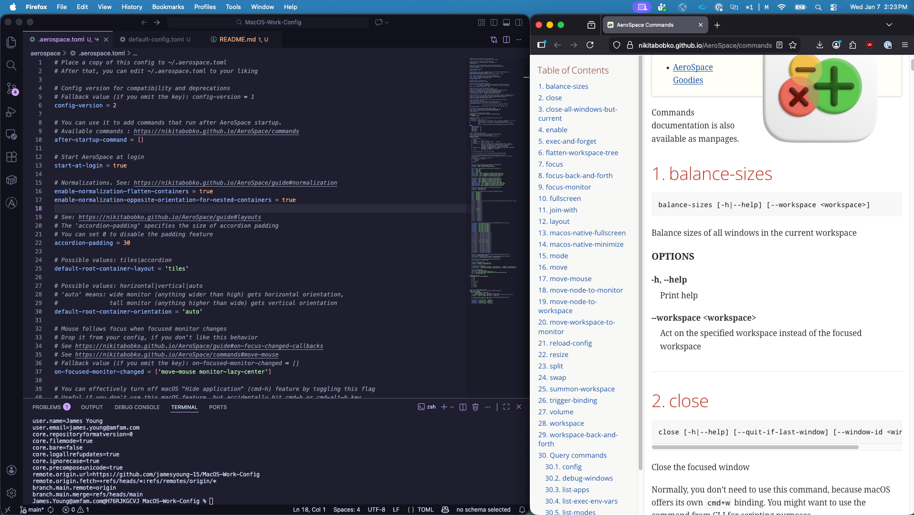

# Work Macbook Configs

My configs, scripts, and other files for setting up my work laptop (Macbook M4 16 Inch). Try to keep it as close to my personal Linux machines.

## Preview



## Main Tools

- Window Manager: Aerospace
- Package Manager: Homebrew
- Shell: Zsh
- Terminal Emulator: Kitty

## Setup Instructions

### Pre-reqs

- Homebrew

### Install Homebrew Packages

``` bash
cd homebrew
brew bundle install
```

### Setup Aerospace

Below is for my Aerospace workflow (0.20.2-Beta). Check [docs](https://nikitabobko.github.io/AeroSpace/guide) in case of changes.

#### 1. Set keyboard shortcut settings

- Go to `Settings -> Keyboard -> Keyboard Shortcuts`
- In `Modifier Keys`, swap `Command` and `Ctrl` to mimic more of my Linux keyboard shortcuts
- In `Windows -> Halves`, change all the tile keybindings to something random since I use those keybindings for aerospace
- Turn off all potential keyboard shortcut conflicts, some are:
  - `Mission Control` shortcuts
  - Most `Windows` shortcuts

#### 2. Fix Mission Control Windows Size

Enable Group windows by application, either with:

``` bash
defaults write com.apple.dock expose-group-apps -bool true && killall Dock
```

or in `System Settings → Desktop & Dock → Group windows by application`


#### 3. Turn off 'Displays have separate Spaces'

Either with: 

``` bash
defaults write com.apple.spaces spans-displays -bool true && killall SystemUIServer
```

or in `System Settings → Desktop & Dock → Displays have separate Spaces` and turn it off for more stable experience

#### 4. Setup Aeorospace config

Can add symlink or just copy contents into config file, then refresh config.

``` bash
ln -s aerospace/.aerospace.toml ~/.aerospace.toml
```

## Side Notes

Since this machine is managed by IT with Zscaler, my colleague suggested I use Homebrew only instead of Nix even though I use NixOS on my personal machine and have Nixpkgs setup. This is because Zscaler cert inspection tool often causes trouble with Nix.

Anyways for me, Brewfile + config files + bash scripts will do the "declarative config" approach good enough for now. I may explore using Nix-Darwin + Home Manager later on, but I'm not really an expert on Nix anyways and haven't tried with Mac before only on NixOS.
